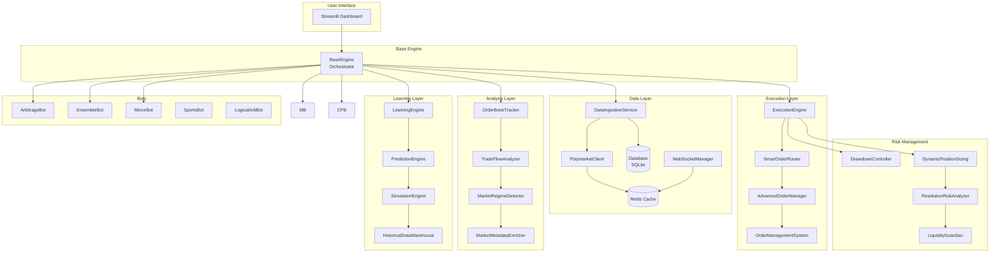
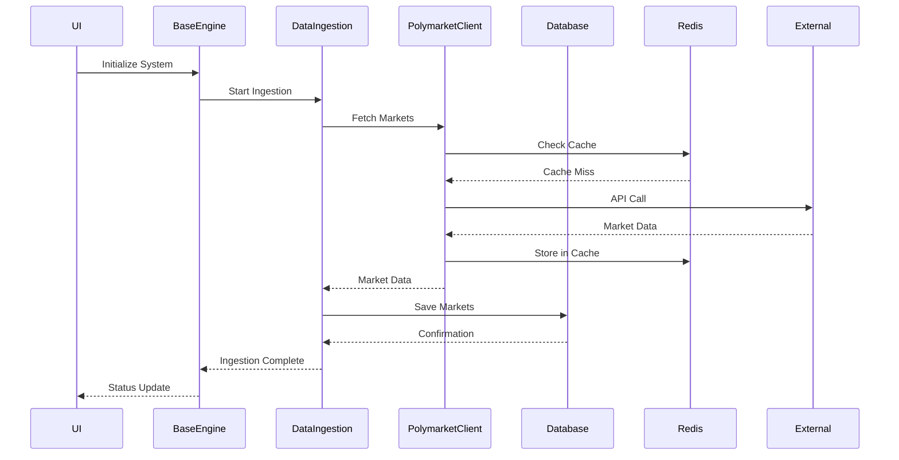
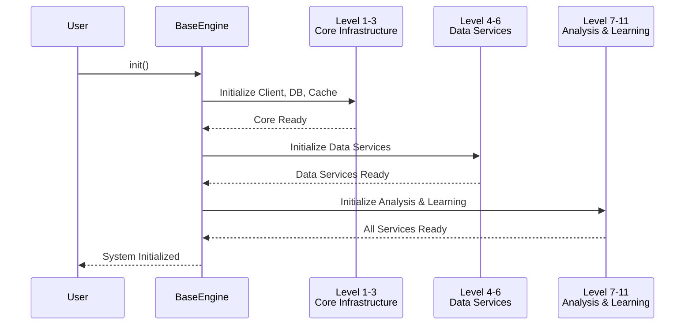
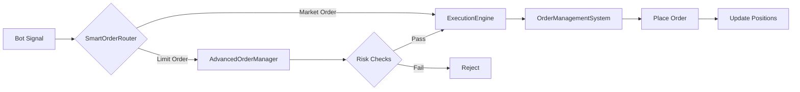

# System Architecture Diagram

## High-Level Architecture

```mermaid
graph TB
    subgraph "User Interface"
        UI[Streamlit Dashboard]
    end
    
    subgraph "Base Engine"
        BE[BaseEngine<br/>Orchestrator]
    end
    
    subgraph "Data Layer"
        DI[DataIngestionService]
        PC[PolymarketClient]
        DB[(Database<br/>SQLite)]
        Cache[(Redis Cache)]
        WS[WebSocketManager]
    end
    
    subgraph "Execution Layer"
        EE[ExecutionEngine]
        SOR[SmartOrderRouter]
        AOM[AdvancedOrderManager]
        OMS[OrderManagementSystem]
    end
    
    subgraph "Analysis Layer"
        OBT[OrderBookTracker]
        TFA[TradeFlowAnalyzer]
        MRD[MarketRegimeDetector]
        MME[MarketMetadataEnricher]
    end
    
    subgraph "Learning Layer"
        LE[LearningEngine]
        PE[PredictionEngine]
        SE[SimulationEngine]
        HDW[HistoricalDataWarehouse]
    end
    
    subgraph "Risk Management"
        DC[DrawdownController]
        DPS[DynamicPositionSizing]
        RRA[ResolutionRiskAnalyzer]
        LG[LiquidityGuardian]
    end
    
    subgraph "Bots"
        AB[ArbitrageBot]
        EB[EnsembleBot]
        MRB[MirrorBot]
        SB[SportsBot]
        LB[LogicalArbBot]
    end
    
    UI --> BE
    BE --> DI
    BE --> EE
    BE --> LE
    BE --> OBT
    
    DI --> PC
    DI --> DB
    PC --> Cache
    WS --> Cache
    
    EE --> SOR
    SOR --> AOM
    AOM --> OMS
    
    OBT --> TFA
    TFA --> MRD
    MRD --> MME
    
    LE --> PE
    PE --> SE
    SE --> HDW
    
    EE --> DC
    EE --> DPS
    DPS --> RRA
    RRA --> LG
    
    BE --> AB
    BE --> MB
    BE --> EB
    BE --> MRB
    BE --> CPB
```

## Data Flow

```mermaid
sequenceDiagram
    participant UI
    participant BE as BaseEngine
    participant DI as DataIngestion
    participant PC as PolymarketClient
    participant DB as Database
    participant Cache as Redis
    
    UI->>BE: Initialize System
    BE->>DI: Start Ingestion
    DI->>PC: Fetch Markets
    PC->>Cache: Check Cache
    Cache-->>PC: Cache Miss
    PC->>External: API Call
    External-->>PC: Market Data
    PC->>Cache: Store in Cache
    PC-->>DI: Market Data
    DI->>DB: Save Markets
    DB-->>DI: Confirmation
    DI-->>BE: Ingestion Complete
    BE-->>UI: Status Update
```

## Initialization Sequence

```mermaid
sequenceDiagram
    participant User
    participant BE as BaseEngine
    participant L1 as Level 1-3<br/>Core Infrastructure
    participant L2 as Level 4-6<br/>Data Services
    participant L3 as Level 7-11<br/>Analysis & Learning
    
    User->>BE: init()
    BE->>L1: Initialize Client, DB, Cache
    L1-->>BE: Core Ready
    BE->>L2: Initialize Data Services
    L2-->>BE: Data Services Ready
    BE->>L3: Initialize Analysis & Learning
    L3-->>BE: All Services Ready
    BE-->>User: System Initialized
```

## Order Execution Flow

```mermaid
graph LR
    A[Bot Signal] --> B{SmartOrderRouter}
    B -->|Market Order| C[ExecutionEngine]
    B -->|Limit Order| D[AdvancedOrderManager]
    D --> E{Risk Checks}
    E -->|Pass| C
    E -->|Fail| F[Reject]
    C --> G[OrderManagementSystem]
    G --> H[Place Order]
    H --> I[Update Positions]
```
